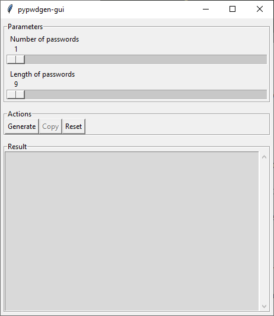
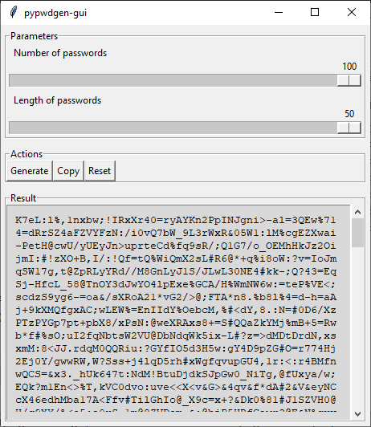
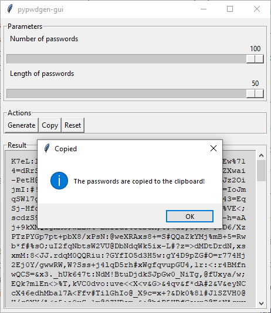

# pypwdgen-gui
This is an example GUI made with tkinter using [pypwdgen](https://github.com/polluxtroy3758/pypwdgen).

It offers basic settings such as number and length of passwords to generate

Once generated, the passwords can easily be copied to clipboard in a single click.

## Prerequisites
The package `pypwdgen` is required. Install it with:

```shell
pip install pypwdgen
```

Or:

```shell
pip install -r requirements.txt
```

## Usage
You just have to run the python file:

```shell
python pypwdgen-gui.py
```

## Screenshots
At startup:



Some password generated:



All passwords copied to the clipboard:

